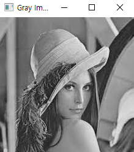
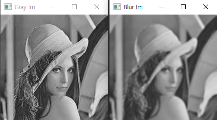
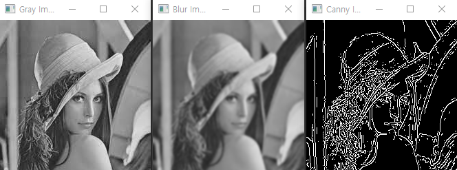
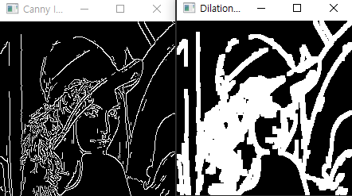
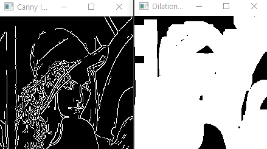
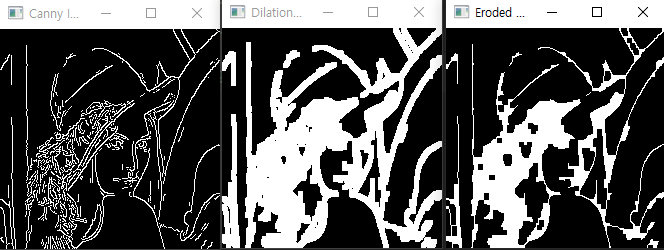

## OpenCV 공부 - Day1
### Reference
> https://www.youtube.com/watch?v=WQeoO7MI0Bs&t=2990s


### 이미지 출력
```python
print("Package Imported")

img = cv2.imread("Resources/lena.jpg")

cv2.imshow("Output", img)
cv2.waitKey(0)
```


### mp4 파일 출력
```python
cap = cv2.VideoCapture("Resources/test_video.mp4")

while True:
    success, img = cap.read()
    cv2.imshow("Video", img)
    if cv2.waitKey(1) & 0xFF == ord('q'):
        break
```


### 웹캠 사용
```python
# Web cam 사용
cap = cv2.VideoCapture("0")
cap.set(3, 640)
cap.set(4, 480)
cap.set(10, 100)   # brightness 증가

while True:
    success, img = cap.read()
    cv2.imshow("Video", img)
    if cv2.waitKey(1) & 0xFF == ord('q'):
        break
```

### Gray Image
```python
import cv2

img = cv2.imread("Resources/lena.jpg")

imgGray = cv2.cvtColor(img, cv2.COLOR_BGR2GRAY)

cv2.imshow("Gray Image", imgGray)
cv2.waitKey(0)
```



### Blur Image
```python
import cv2

img = cv2.imread("Resources/lena.jpg")

imgGray = cv2.cvtColor(img, cv2.COLOR_BGR2GRAY)
imgBlur = cv2.GaussianBlur(imgGray, (7, 7), 0)

cv2.imshow("Gray Image", imgGray)
cv2.imshow("Blur Image", imgBlur)
cv2.waitKey(0)
```



### Canny Image
```python
import cv2

img = cv2.imread("Resources/lena.jpg")

imgGray = cv2.cvtColor(img, cv2.COLOR_BGR2GRAY)
imgBlur = cv2.GaussianBlur(imgGray, (7, 7), 0)
imgCanny = cv2.Canny(img, 100, 100)

cv2.imshow("Gray Image", imgGray)
cv2.imshow("Blur Image", imgBlur)
cv2.imshow("Canny Image", imgCanny)
cv2.waitKey(0)
```



### Dilation Image
```python
import cv2
import numpy as np

img = cv2.imread("Resources/lena.jpg")
kernel = np.ones((5, 5), np.uint8)

imgGray = cv2.cvtColor(img, cv2.COLOR_BGR2GRAY)
imgBlur = cv2.GaussianBlur(imgGray, (7, 7), 0)
imgCanny = cv2.Canny(img, 150, 200)
imgDialation = cv2.dilate(imgCanny, kernel, iterations=1)

# cv2.imshow("Gray Image", imgGray)
# cv2.imshow("Blur Image", imgBlur)
cv2.imshow("Canny Image", imgCanny)
cv2.imshow("Dilation Image", imgDialation)
cv2.waitKey(0)
```


<br>
`iterations=5`로 할 경우(아래 이미지 참고)




### Eroded Image
```python
import cv2
import numpy as np

img = cv2.imread("Resources/lena.jpg")
kernel = np.ones((5, 5), np.uint8)

imgGray = cv2.cvtColor(img, cv2.COLOR_BGR2GRAY)
imgBlur = cv2.GaussianBlur(imgGray, (7, 7), 0)
imgCanny = cv2.Canny(img, 150, 200)
imgDialation = cv2.dilate(imgCanny, kernel, iterations=1)
imgEroded = cv2.erode(imgDialation, kernel, iterations=1)

# cv2.imshow("Gray Image", imgGray)
# cv2.imshow("Blur Image", imgBlur)
cv2.imshow("Canny Image", imgCanny)
cv2.imshow("Dilation Image", imgDialation)
cv2.imshow("Eroded Image", imgEroded)
cv2.waitKey(0)
```
