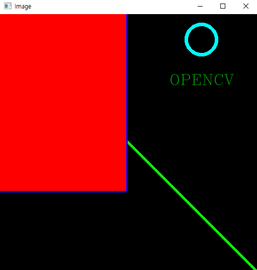

# OpenCV 공부 - Day2
### Reference
> https://www.youtube.com/watch?v=WQeoO7MI0Bs&t=2990s


## Chap3 Crop and Resize
```python
import cv2
import numpy as np

img = cv2.imread("img/img2/lambo.jpg")
print(img.shape)

imgResize = cv2.resize(img, (300, 200))     # 300 : width, 200 : height
print(imgResize.shape)

imgCropped = img[0:200, 200:500]        # 0:200 => height, 200:500 => width

cv2.imshow("Image", img)
cv2.imshow("Image Resize", imgResize)
cv2.imshow("Image Cropped", imgCropped)

cv2.waitKey(0)
```

### 출력결과
- 원본 이미지 출력
- Resize된 이미지 출력
- Crop된 이미지 출력


## Chap4 Shapes and Text
```python
import cv2
import numpy as np

img = np.zeros((512, 512, 3), np.uint8)
print(img.shape)
# img[:] = 255, 0 , 255     # B, G, R

# image, point1, point2, color, thickness 
# cv2.line(img, (0, 0), (300, 300), (0, 255, 0), 3)
cv2.line(img, (0, 0), (img.shape[1], img.shape[0]), (0, 255, 0), 3)
cv2.rectangle(img, (0, 0), (250, 350), (255, 0, 0), 5)
cv2.rectangle(img, (0, 0), (250, 350), (0, 0, 255), cv2.FILLED)
cv2.circle(img, (400, 50), 30, (255, 255, 0), 5)
cv2.putText(img, " OPENCV ", (320, 140), cv2.FONT_HERSHEY_COMPLEX, 1, (0, 150, 0), 1)

cv2.imshow("Image", img)

cv2.waitKey(0)
```

### 출력결과



## Chap5 Warp Perspective
```python
import cv2
import numpy as np

img = cv2.imread("img/img2/cards.jpg")

width, height = 250, 350
'''
그림판에서 커서를 카드 이미지의 꼭짓점에 위치시키면 왼쪽 하단에 픽셀좌표값이 표시됨.
이를 이용해서 꼭짓점 좌표를 확인한 후 아래와 같이 입력하면 됨.
'''
pts1 = np.float32([[355, 153], [489, 122], [455, 290], [596, 247]])
pts2 = np.float32([[0, 0], [width, 0], [0, height], [width, height]])
matrix = cv2.getPerspectiveTransform(pts1, pts2)
imgOutput = cv2.warpPerspective(img, matrix, (width, height))


cv2.imshow("Image", img)
cv2.imshow("Output", imgOutput)

cv2.waitKey(0)
```

### 출력결과


## Chap6 Joining Images
```python
import cv2
import numpy as np

img = cv2.imread("img/img1/lena.jpg")

imgHor = np.hstack((img, img, img))
imgVer = np.vstack((img, img))

# 두개의 이미지가 수평하게 출력됨
cv2.imshow("Horizontal", imgHor)
# 두개의 이미지가 수직으로 출력됨
cv2.imshow("Vertical", imgVer)

cv2.waitKey(0)
```

### 출력결과


<br>

```python
import cv2
import numpy as np

img = cv2.imread("img/img1/lena.jpg")

###########################################
def stackImages(scale,imgArray):
    rows = len(imgArray)
    cols = len(imgArray[0])
    rowsAvailable = isinstance(imgArray[0], list)
    width = imgArray[0][0].shape[1]
    height = imgArray[0][0].shape[0]
    if rowsAvailable:
        for x in range ( 0, rows):
            for y in range(0, cols):
                if imgArray[x][y].shape[:2] == imgArray[0][0].shape [:2]:
                    imgArray[x][y] = cv2.resize(imgArray[x][y], (0, 0), None, scale, scale)
                else:
                    imgArray[x][y] = cv2.resize(imgArray[x][y], (imgArray[0][0].shape[1], imgArray[0][0].shape[0]), None, scale, scale)
                if len(imgArray[x][y].shape) == 2: imgArray[x][y]= cv2.cvtColor( imgArray[x][y], cv2.COLOR_GRAY2BGR)
        imageBlank = np.zeros((height, width, 3), np.uint8)
        hor = [imageBlank]*rows
        hor_con = [imageBlank]*rows
        for x in range(0, rows):
            hor[x] = np.hstack(imgArray[x])
        ver = np.vstack(hor)
    else:
        for x in range(0, rows):
            if imgArray[x].shape[:2] == imgArray[0].shape[:2]:
                imgArray[x] = cv2.resize(imgArray[x], (0, 0), None, scale, scale)
            else:
                imgArray[x] = cv2.resize(imgArray[x], (imgArray[0].shape[1], imgArray[0].shape[0]), None,scale, scale)
            if len(imgArray[x].shape) == 2: imgArray[x] = cv2.cvtColor(imgArray[x], cv2.COLOR_GRAY2BGR)
        hor= np.hstack(imgArray)
        ver = hor
    return ver
###########################################


imgStack1 = stackImages(1, ([img, img, img]))
imgStack2 = stackImages(1, ([img, img, img], [img, img, img]))

imgGray = cv2.cvtColor(img, cv2.COLOR_BGR2GRAY)
img_gray = stackImages(1, ([img, imgGray, img], [img, img, img]))


# imgHor = np.hstack((img, img, img))
# imgVer = np.vstack((img, img))

# # 두개의 이미지가 수평하게 출력됨
# cv2.imshow("Horizontal", imgHor)
# # 두개의 이미지가 수직으로 출력됨
# cv2.imshow("Vertical", imgVer)

cv2.imshow("Image Stack1", imgStack1)
cv2.imshow("Image Stack2", imgStack2)
cv2.imshow("Image Gray", img_gray)

cv2.waitKey(0)
```

### 출력결과


