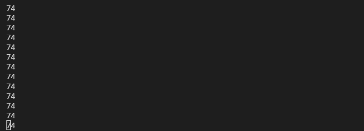

# OpenCV 공부 - Day3
### Reference
> https://www.youtube.com/watch?v=WQeoO7MI0Bs&t=2990s

## Chap7 Color detection

### 7.1 code
```python
import cv2

path = 'img/img3/lambo.jpg'
img = cv2.imread(path)

imgHSV = cv2.cvtColor(img, cv2.COLOR_BGR2HSV)


cv2.imshow("Original", img)
cv2.imshow("HSV", imgHSV)
cv2.waitKey(0)
```

### 출력코드


<br>

### 7.2 code
```python
# Track bar를 간단하게 구현해봄
import cv2

'''
createTrackbar 함수에 5개의 인수를 넣어주어야 에러가 발생하지 않으므로
우선은 아무것도 정의되지 않은 함수를 만듬
'''

def empty(a):
    pass

path = 'img/img3/lambo.jpg'
cv2.namedWindow("TrackBars")
cv2.resizeWindow("TrackBars", 640, 240)
# Track bar의 범위 지정 (0 ~ 179), 참고 : Hue("색상"이라는 뜻)
cv2.createTrackbar("Hue Min", "TrackBars", 0, 179, empty)

cv2.waitKey(0)
```

### 출력결과


- 위의 두 이미지를 통해 0 ~ 179까지의 범위가 잘 지정된 것으로 보임

<br>

### 7.3 code
```python
import cv2

def empty(a):
    pass

path = 'img/img3/lambo.jpg'
cv2.namedWindow("TrackBars")
cv2.resizeWindow("TrackBars", 640, 240)

# Hue(색상) track bar
cv2.createTrackbar("Hue Min", "TrackBars", 0, 179, empty)
cv2.createTrackbar("Hue Max", "TrackBars", 179, 179, empty)

# Saturation(채도) track bar
cv2.createTrackbar("Sat Min", "TrackBars", 0, 255, empty)
cv2.createTrackbar("Sat Max", "TrackBars", 255, 255, empty)

# Value(값) track bar
cv2.createTrackbar("Val Min", "TrackBars", 0, 179, empty)
cv2.createTrackbar("Val Max", "TrackBars", 255, 255, empty)

cv2.waitKey(0)
```

### 출력결과


- 지정된 여러개의 track bar가 잘 출력된 것을 확인할 수 있음

<br>

### 7.4 code
```python
import cv2

def empty(a):
    pass

path = 'img/img3/lambo.jpg'
cv2.namedWindow("TrackBars")
cv2.resizeWindow("TrackBars", 640, 240)

# Hue(색상) track bar
cv2.createTrackbar("Hue Min", "TrackBars", 0, 179, empty)
cv2.createTrackbar("Hue Max", "TrackBars", 179, 179, empty)

# Saturation(채도) track bar
cv2.createTrackbar("Sat Min", "TrackBars", 0, 255, empty)
cv2.createTrackbar("Sat Max", "TrackBars", 255, 255, empty)

# Value(값) track bar
cv2.createTrackbar("Val Min", "TrackBars", 0, 179, empty)
cv2.createTrackbar("Val Max", "TrackBars", 255, 255, empty)

while True:
    img = cv2.imread(path)

    imgHSV = cv2.cvtColor(img, cv2.COLOR_BGR2HSV)

    # getTrackbarPos("Trackbar name", "Window name")
    h_min = cv2.getTrackbarPos("Hue Min", "TrackBars")
    print(h_min)

    # cv2.imshow("Original", img)
    # cv2.imshow("HSV", imgHSV)
    cv2.waitKey(1)
```

### 출력결과


- "Hue Min" Trackbar를 0으로 위치한 경우 출력값



- "Hue Min" Trackbar를 74로 위치한 경우 출력값

<br>

### 7.5 code
```python
import cv2
import numpy as np

def empty(a):
    pass

path = 'img/img3/lambo.jpg'
cv2.namedWindow("TrackBars")
cv2.resizeWindow("TrackBars", 640, 240)

# Hue(색상) track bar
cv2.createTrackbar("Hue Min", "TrackBars", 0, 179, empty)
cv2.createTrackbar("Hue Max", "TrackBars", 179, 179, empty)

# Saturation(채도) track bar
cv2.createTrackbar("Sat Min", "TrackBars", 0, 255, empty)
cv2.createTrackbar("Sat Max", "TrackBars", 255, 255, empty)

# Value(값) track bar
cv2.createTrackbar("Val Min", "TrackBars", 0, 179, empty)
cv2.createTrackbar("Val Max", "TrackBars", 255, 255, empty)

while True:
    img = cv2.imread(path)

    imgHSV = cv2.cvtColor(img, cv2.COLOR_BGR2HSV)

    # getTrackbarPos("Trackbar name", "Window name")
    h_min = cv2.getTrackbarPos("Hue Min", "TrackBars")
    h_max = cv2.getTrackbarPos("Hue Max", "TrackBars")
    s_min = cv2.getTrackbarPos("Sat Min", "TrackBars")
    s_max = cv2.getTrackbarPos("Sat Max", "TrackBars")
    v_min = cv2.getTrackbarPos("Val Min", "TrackBars")
    v_max = cv2.getTrackbarPos("Val Max", "TrackBars")

    print(h_min, h_max, s_min, s_max, v_min, v_max)
    
    lower = np.array([h_min, s_min, v_min])
    upper = np.array([h_max, s_max, v_max])

    # inRange(src, lower boundary, upper boundary)
    mask = cv2.inRange(imgHSV, lower, upper)

    cv2.imshow("Original", img)
    cv2.imshow("HSV", imgHSV)
    cv2.imshow("Mask", mask)
    cv2.waitKey(1)
```

### 출력결과


- Track bar를 조절하면 값에 따라 위와 같이 이미지가 변함

<br>

### 7.6 code
```python
import cv2
import numpy as np

def empty(a):
    pass

path = 'img/img3/lambo.jpg'
cv2.namedWindow("TrackBars")
cv2.resizeWindow("TrackBars", 640, 240)

'''
이전에 track bar가 출력되었을 때 흰색 이미지가 적절하게 출력되는 부분을
임의로 설정하여 default 값으로 지정함
'''
# Hue(색상) track bar
cv2.createTrackbar("Hue Min", "TrackBars", 0, 179, empty)
cv2.createTrackbar("Hue Max", "TrackBars", 179, 179, empty)

# Saturation(채도) track bar
cv2.createTrackbar("Sat Min", "TrackBars", 0, 255, empty)
cv2.createTrackbar("Sat Max", "TrackBars", 255, 255, empty)

# Value(값) track bar
cv2.createTrackbar("Val Min", "TrackBars", 93, 255, empty)
cv2.createTrackbar("Val Max", "TrackBars", 255, 255, empty)

while True:
    img = cv2.imread(path)

    imgHSV = cv2.cvtColor(img, cv2.COLOR_BGR2HSV)

    # getTrackbarPos("Trackbar name", "Window name")
    h_min = cv2.getTrackbarPos("Hue Min", "TrackBars")
    h_max = cv2.getTrackbarPos("Hue Max", "TrackBars")
    s_min = cv2.getTrackbarPos("Sat Min", "TrackBars")
    s_max = cv2.getTrackbarPos("Sat Max", "TrackBars")
    v_min = cv2.getTrackbarPos("Val Min", "TrackBars")
    v_max = cv2.getTrackbarPos("Val Max", "TrackBars")

    print(h_min, h_max, s_min, s_max, v_min, v_max)
    
    lower = np.array([h_min, s_min, v_min])
    upper = np.array([h_max, s_max, v_max])

    # inRange(src, lower boundary, upper boundary)
    mask = cv2.inRange(imgHSV, lower, upper)
    # bitwise : original 이미지와 mask 이미지 and 비트 연산함
    imgResult = cv2.bitwise_and(img, img, mask=mask)

    cv2.imshow("Original", img)
    cv2.imshow("HSV", imgHSV)
    cv2.imshow("Mask", mask)
    cv2.imshow("Image Result", imgResult)
    cv2.waitKey(1)
```


- [cv2.bitwise_and](https://velog.io/@dldndyd01/OpenCV-bitwiseand-or-xor-not-%EA%B8%B0%EB%8A%A5-%EC%A0%95%EB%A6%AC-RGB-Image#:~:text=%EC%B6%9C%EB%A0%A5%ED%95%98%EB%8A%94%EC%A7%80%20%EA%B6%81%EA%B8%88%ED%95%98%EC%97%AC%20%EC%95%8C%EC%95%84%EB%B3%B4%EC%95%98%EC%8A%B5%EB%8B%88%EB%8B%A4.-,bitwise_and,-res_and%20%3D%20cv.bitwise_and) : mask 영역에서 서로 공통으로 겹치는 부분 출력


### 출력결과


<br>

### 7.6 code
```python
import cv2
import numpy as np

def empty(a):
    pass

def stackImages(scale,imgArray):
    rows = len(imgArray)
    cols = len(imgArray[0])
    rowsAvailable = isinstance(imgArray[0], list)
    width = imgArray[0][0].shape[1]
    height = imgArray[0][0].shape[0]
    if rowsAvailable:
        for x in range ( 0, rows):
            for y in range(0, cols):
                if imgArray[x][y].shape[:2] == imgArray[0][0].shape [:2]:
                    imgArray[x][y] = cv2.resize(imgArray[x][y], (0, 0), None, scale, scale)
                else:
                    imgArray[x][y] = cv2.resize(imgArray[x][y], (imgArray[0][0].shape[1], imgArray[0][0].shape[0]), None, scale, scale)
                if len(imgArray[x][y].shape) == 2: imgArray[x][y]= cv2.cvtColor( imgArray[x][y], cv2.COLOR_GRAY2BGR)
        imageBlank = np.zeros((height, width, 3), np.uint8)
        hor = [imageBlank]*rows
        hor_con = [imageBlank]*rows
        for x in range(0, rows):
            hor[x] = np.hstack(imgArray[x])
        ver = np.vstack(hor)
    else:
        for x in range(0, rows):
            if imgArray[x].shape[:2] == imgArray[0].shape[:2]:
                imgArray[x] = cv2.resize(imgArray[x], (0, 0), None, scale, scale)
            else:
                imgArray[x] = cv2.resize(imgArray[x], (imgArray[0].shape[1], imgArray[0].shape[0]), None,scale, scale)
            if len(imgArray[x].shape) == 2: imgArray[x] = cv2.cvtColor(imgArray[x], cv2.COLOR_GRAY2BGR)
        hor= np.hstack(imgArray)
        ver = hor
    return ver


path = 'img/img3/lambo.jpg'
cv2.namedWindow("TrackBars")
cv2.resizeWindow("TrackBars", 640, 240)

# Hue(색상) track bar
cv2.createTrackbar("Hue Min", "TrackBars", 0, 179, stackImages)
cv2.createTrackbar("Hue Max", "TrackBars", 179, 179, stackImages)

# Saturation(채도) track bar
cv2.createTrackbar("Sat Min", "TrackBars", 0, 255, stackImages)
cv2.createTrackbar("Sat Max", "TrackBars", 255, 255, stackImages)

# Value(값) track bar
cv2.createTrackbar("Val Min", "TrackBars", 93, 255, stackImages)
cv2.createTrackbar("Val Max", "TrackBars", 255, 255, stackImages)

while True:
    img = cv2.imread(path)

    imgHSV = cv2.cvtColor(img, cv2.COLOR_BGR2HSV)

    # getTrackbarPos("Trackbar name", "Window name")
    h_min = cv2.getTrackbarPos("Hue Min", "TrackBars")
    h_max = cv2.getTrackbarPos("Hue Max", "TrackBars")
    s_min = cv2.getTrackbarPos("Sat Min", "TrackBars")
    s_max = cv2.getTrackbarPos("Sat Max", "TrackBars")
    v_min = cv2.getTrackbarPos("Val Min", "TrackBars")
    v_max = cv2.getTrackbarPos("Val Max", "TrackBars")

    print(h_min, h_max, s_min, s_max, v_min, v_max)
    
    lower = np.array([h_min, s_min, v_min])
    upper = np.array([h_max, s_max, v_max])

    # inRange(src, lower boundary, upper boundary)
    mask = cv2.inRange(imgHSV, lower, upper)
    imgResult = cv2.bitwise_and(img, img, mask=mask)

    # cv2.imshow("Original", img)
    # cv2.imshow("HSV", imgHSV)
    # cv2.imshow("Mask", mask)
    # cv2.imshow("Image Result", imgResult)
    
    imgStack = stackImages(0.6, ([img, imgHSV], [mask, imgResult]))
    cv2.imshow("Stack Images", imgStack)

    cv2.waitKey(1)
```

- stackImages() : [Chapter6](https://github.com/Jarvis-Geun/OpencvPython/blob/main/python/Chap6.py)에서 사용한 함수를 가져옴

### 출력결과


- 윈도우 창 하나에 모두 출력