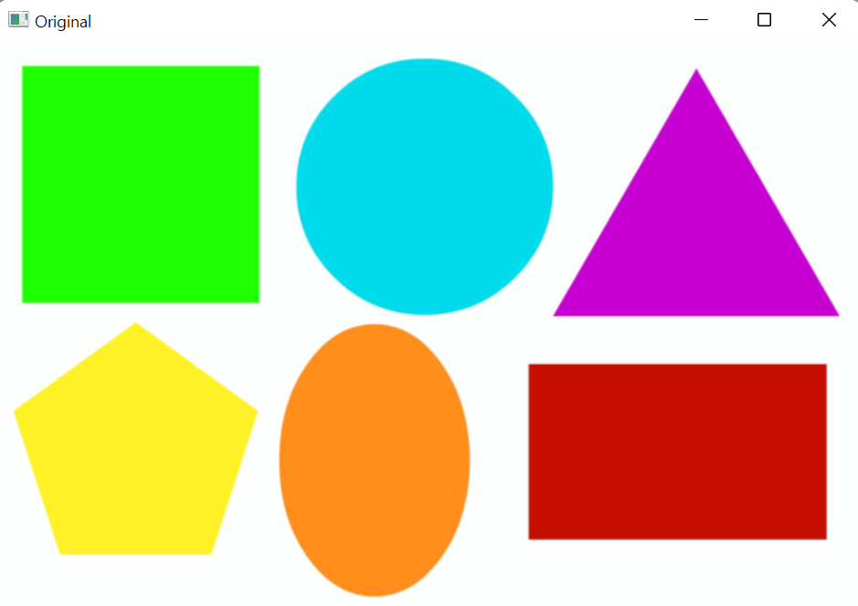
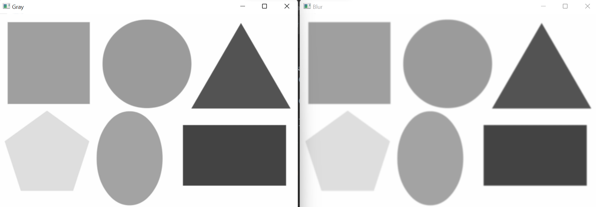
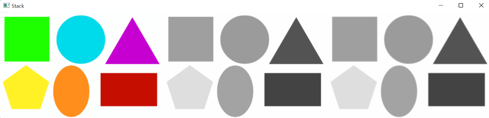

# OpenCV 공부 - Day4
### Reference
> https://www.youtube.com/watch?v=WQeoO7MI0Bs&t=2990s

## Chap8 Contours / Shape Detection

### 8.1 code
```python
import cv2
from cv2 import COLOR_BGR2GRAY
import numpy as np

path = 'img/img4/shapes.png'
img = cv2.imread(path)

imgGray = cv2.cvtColor(img, COLOR_BGR2GRAY)
imgBlur = cv2.GaussianBlur(imgGray, (7, 7), 1)

cv2.imshow("Original", img)
cv2.imshow("Gray", imgGray)
cv2.imshow("Blur", imgBlur)
cv2.waitKey(0)
```
- [Gaussian Blur에 대한 설명1](https://en.wikipedia.org/wiki/Gaussian_blur#:~:text=Gaussian%20blur,-From%20Wikipedia%2C%20the)
- [Gaussian Blur에 대한 설명2](https://bkshin.tistory.com/entry/OpenCV-17-%ED%95%84%ED%84%B0Filter%EC%99%80-%EC%BB%A8%EB%B3%BC%EB%A3%A8%EC%85%98Convolution-%EC%97%B0%EC%82%B0-%ED%8F%89%EA%B7%A0-%EB%B8%94%EB%9F%AC%EB%A7%81-%EA%B0%80%EC%9A%B0%EC%8B%9C%EC%95%88-%EB%B8%94%EB%9F%AC%EB%A7%81-%EB%AF%B8%EB%94%94%EC%96%B8-%EB%B8%94%EB%9F%AC%EB%A7%81-%EB%B0%94%EC%9D%B4%EB%A0%88%ED%84%B0%EB%9F%B4-%ED%95%84%ED%84%B0#:~:text=%EA%B0%80%EC%9A%B0%EC%8B%9C%EC%95%88%20%EB%B8%94%EB%9F%AC%EB%A7%81(Gaussian%20Blurring))  
가우시안 분포를 갖는 커널로 블러링하는 것을 가우시안 블러링이라고 함. 가우시안 블러링 커널은 중앙값이 가장 크고 중앙에서 멀어질수록 값이 작아짐. 이러한 특성으로 인해, 대상 픽셀에 특정 커널이 가까운 값을 가질수록 더 큰 영향을 주며 먼 값을 가질수록 더 적은 영향을 줌. 이러한 이유로 `원래의 영상과 비슷한 결과를 가짐과 동시에 노이즈를 제거`할 수 있게 됨. 자세한 설명은 [링크](https://bkshin.tistory.com/entry/OpenCV-17-%ED%95%84%ED%84%B0Filter%EC%99%80-%EC%BB%A8%EB%B3%BC%EB%A3%A8%EC%85%98Convolution-%EC%97%B0%EC%82%B0-%ED%8F%89%EA%B7%A0-%EB%B8%94%EB%9F%AC%EB%A7%81-%EA%B0%80%EC%9A%B0%EC%8B%9C%EC%95%88-%EB%B8%94%EB%9F%AC%EB%A7%81-%EB%AF%B8%EB%94%94%EC%96%B8-%EB%B8%94%EB%9F%AC%EB%A7%81-%EB%B0%94%EC%9D%B4%EB%A0%88%ED%84%B0%EB%9F%B4-%ED%95%84%ED%84%B0#:~:text=%EA%B0%80%EC%9A%B0%EC%8B%9C%EC%95%88%20%EB%B8%94%EB%9F%AC%EB%A7%81(Gaussian%20Blurring)) 참고.


### 출력결과



<br>

## 8.2 Stack Image code
```python
import cv2
from cv2 import COLOR_BGR2GRAY
import numpy as np

#########################################
def stackImages(scale,imgArray):
    rows = len(imgArray)
    cols = len(imgArray[0])
    rowsAvailable = isinstance(imgArray[0], list)
    width = imgArray[0][0].shape[1]
    height = imgArray[0][0].shape[0]
    if rowsAvailable:
        for x in range ( 0, rows):
            for y in range(0, cols):
                if imgArray[x][y].shape[:2] == imgArray[0][0].shape [:2]:
                    imgArray[x][y] = cv2.resize(imgArray[x][y], (0, 0), None, scale, scale)
                else:
                    imgArray[x][y] = cv2.resize(imgArray[x][y], (imgArray[0][0].shape[1], imgArray[0][0].shape[0]), None, scale, scale)
                if len(imgArray[x][y].shape) == 2: imgArray[x][y]= cv2.cvtColor( imgArray[x][y], cv2.COLOR_GRAY2BGR)
        imageBlank = np.zeros((height, width, 3), np.uint8)
        hor = [imageBlank]*rows
        hor_con = [imageBlank]*rows
        for x in range(0, rows):
            hor[x] = np.hstack(imgArray[x])
        ver = np.vstack(hor)
    else:
        for x in range(0, rows):
            if imgArray[x].shape[:2] == imgArray[0].shape[:2]:
                imgArray[x] = cv2.resize(imgArray[x], (0, 0), None, scale, scale)
            else:
                imgArray[x] = cv2.resize(imgArray[x], (imgArray[0].shape[1], imgArray[0].shape[0]), None,scale, scale)
            if len(imgArray[x].shape) == 2: imgArray[x] = cv2.cvtColor(imgArray[x], cv2.COLOR_GRAY2BGR)
        hor= np.hstack(imgArray)
        ver = hor
    return ver
#########################################


path = 'img/img4/shapes.png'
img = cv2.imread(path)

imgGray = cv2.cvtColor(img, COLOR_BGR2GRAY)
# GaussianBlur(src, ksize(=kernel size), sigmaX, ...)
imgBlur = cv2.GaussianBlur(imgGray, (7, 7), 1)

imgStack = stackImages(0.6, ([img, imgGray, imgBlur]))

cv2.imshow("Stack", imgStack)
cv2.waitKey(0)
```

### 출력결과
