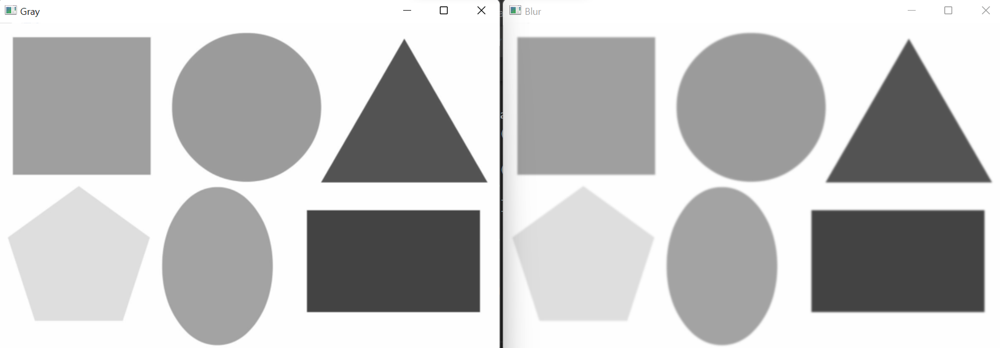
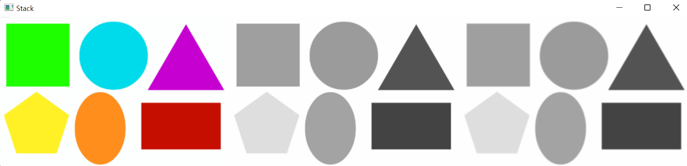
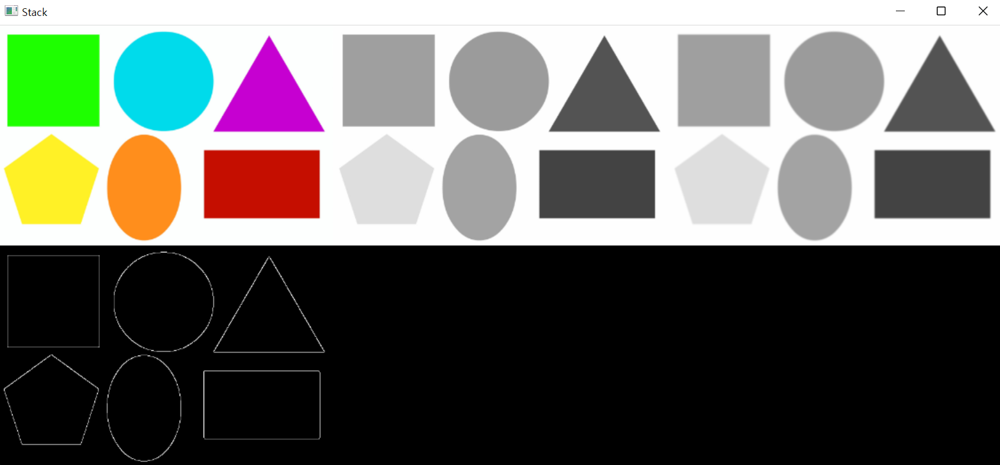
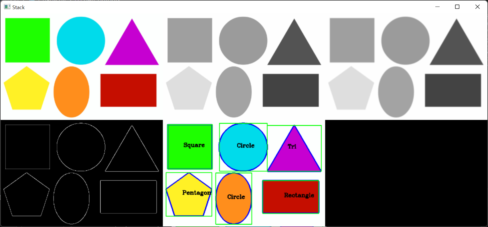

# OpenCV 공부 - Day4
### Reference
> https://www.youtube.com/watch?v=WQeoO7MI0Bs&t=2990s

<br>

## Chap8 Contours / Shape Detection
`countour` : 윤곽, 경계선, 등고선

### 8.1 code
```python
import cv2
from cv2 import COLOR_BGR2GRAY
import numpy as np

path = 'img/img4/shapes.png'
img = cv2.imread(path)

imgGray = cv2.cvtColor(img, COLOR_BGR2GRAY)
imgBlur = cv2.GaussianBlur(imgGray, (7, 7), 1)

cv2.imshow("Original", img)
cv2.imshow("Gray", imgGray)
cv2.imshow("Blur", imgBlur)
cv2.waitKey(0)
```
- [Gaussian Blur에 대한 설명1](https://en.wikipedia.org/wiki/Gaussian_blur#:~:text=Gaussian%20blur,-From%20Wikipedia%2C%20the)
- [Gaussian Blur에 대한 설명2](https://bkshin.tistory.com/entry/OpenCV-17-%ED%95%84%ED%84%B0Filter%EC%99%80-%EC%BB%A8%EB%B3%BC%EB%A3%A8%EC%85%98Convolution-%EC%97%B0%EC%82%B0-%ED%8F%89%EA%B7%A0-%EB%B8%94%EB%9F%AC%EB%A7%81-%EA%B0%80%EC%9A%B0%EC%8B%9C%EC%95%88-%EB%B8%94%EB%9F%AC%EB%A7%81-%EB%AF%B8%EB%94%94%EC%96%B8-%EB%B8%94%EB%9F%AC%EB%A7%81-%EB%B0%94%EC%9D%B4%EB%A0%88%ED%84%B0%EB%9F%B4-%ED%95%84%ED%84%B0#:~:text=%EA%B0%80%EC%9A%B0%EC%8B%9C%EC%95%88%20%EB%B8%94%EB%9F%AC%EB%A7%81(Gaussian%20Blurring))  
가우시안 분포를 갖는 커널로 블러링하는 것을 가우시안 블러링이라고 함. 가우시안 블러링 커널은 중앙값이 가장 크고 중앙에서 멀어질수록 값이 작아짐. 이러한 특성으로 인해, 대상 픽셀에 특정 커널이 가까운 값을 가질수록 더 큰 영향을 주며 먼 값을 가질수록 더 적은 영향을 줌. 이러한 이유로 `원래의 영상과 비슷한 결과를 가짐과 동시에 노이즈를 제거`할 수 있게 됨. 자세한 설명은 [링크](https://bkshin.tistory.com/entry/OpenCV-17-%ED%95%84%ED%84%B0Filter%EC%99%80-%EC%BB%A8%EB%B3%BC%EB%A3%A8%EC%85%98Convolution-%EC%97%B0%EC%82%B0-%ED%8F%89%EA%B7%A0-%EB%B8%94%EB%9F%AC%EB%A7%81-%EA%B0%80%EC%9A%B0%EC%8B%9C%EC%95%88-%EB%B8%94%EB%9F%AC%EB%A7%81-%EB%AF%B8%EB%94%94%EC%96%B8-%EB%B8%94%EB%9F%AC%EB%A7%81-%EB%B0%94%EC%9D%B4%EB%A0%88%ED%84%B0%EB%9F%B4-%ED%95%84%ED%84%B0#:~:text=%EA%B0%80%EC%9A%B0%EC%8B%9C%EC%95%88%20%EB%B8%94%EB%9F%AC%EB%A7%81(Gaussian%20Blurring)) 참고.


### 출력결과



<br>

## 8.2 Stack Image code
```python
import cv2
from cv2 import COLOR_BGR2GRAY
import numpy as np

#########################################
def stackImages(scale,imgArray):
    rows = len(imgArray)
    cols = len(imgArray[0])
    rowsAvailable = isinstance(imgArray[0], list)
    width = imgArray[0][0].shape[1]
    height = imgArray[0][0].shape[0]
    if rowsAvailable:
        for x in range ( 0, rows):
            for y in range(0, cols):
                if imgArray[x][y].shape[:2] == imgArray[0][0].shape [:2]:
                    imgArray[x][y] = cv2.resize(imgArray[x][y], (0, 0), None, scale, scale)
                else:
                    imgArray[x][y] = cv2.resize(imgArray[x][y], (imgArray[0][0].shape[1], imgArray[0][0].shape[0]), None, scale, scale)
                if len(imgArray[x][y].shape) == 2: imgArray[x][y]= cv2.cvtColor( imgArray[x][y], cv2.COLOR_GRAY2BGR)
        imageBlank = np.zeros((height, width, 3), np.uint8)
        hor = [imageBlank]*rows
        hor_con = [imageBlank]*rows
        for x in range(0, rows):
            hor[x] = np.hstack(imgArray[x])
        ver = np.vstack(hor)
    else:
        for x in range(0, rows):
            if imgArray[x].shape[:2] == imgArray[0].shape[:2]:
                imgArray[x] = cv2.resize(imgArray[x], (0, 0), None, scale, scale)
            else:
                imgArray[x] = cv2.resize(imgArray[x], (imgArray[0].shape[1], imgArray[0].shape[0]), None,scale, scale)
            if len(imgArray[x].shape) == 2: imgArray[x] = cv2.cvtColor(imgArray[x], cv2.COLOR_GRAY2BGR)
        hor= np.hstack(imgArray)
        ver = hor
    return ver
#########################################


path = 'img/img4/shapes.png'
img = cv2.imread(path)

imgGray = cv2.cvtColor(img, COLOR_BGR2GRAY)
# GaussianBlur(src, ksize(=kernel size), sigmaX, ...)
imgBlur = cv2.GaussianBlur(imgGray, (7, 7), 1)

imgStack = stackImages(0.6, ([img, imgGray, imgBlur]))

cv2.imshow("Stack", imgStack)
cv2.waitKey(0)
```

### 출력결과


<br>


## 8.3 code
```python
import cv2
from cv2 import COLOR_BGR2GRAY
import numpy as np

#########################################
def stackImages(scale,imgArray):
    rows = len(imgArray)
    cols = len(imgArray[0])
    rowsAvailable = isinstance(imgArray[0], list)
    width = imgArray[0][0].shape[1]
    height = imgArray[0][0].shape[0]
    if rowsAvailable:
        for x in range ( 0, rows):
            for y in range(0, cols):
                if imgArray[x][y].shape[:2] == imgArray[0][0].shape [:2]:
                    imgArray[x][y] = cv2.resize(imgArray[x][y], (0, 0), None, scale, scale)
                else:
                    imgArray[x][y] = cv2.resize(imgArray[x][y], (imgArray[0][0].shape[1], imgArray[0][0].shape[0]), None, scale, scale)
                if len(imgArray[x][y].shape) == 2: imgArray[x][y]= cv2.cvtColor( imgArray[x][y], cv2.COLOR_GRAY2BGR)
        imageBlank = np.zeros((height, width, 3), np.uint8)
        hor = [imageBlank]*rows
        hor_con = [imageBlank]*rows
        for x in range(0, rows):
            hor[x] = np.hstack(imgArray[x])
        ver = np.vstack(hor)
    else:
        for x in range(0, rows):
            if imgArray[x].shape[:2] == imgArray[0].shape[:2]:
                imgArray[x] = cv2.resize(imgArray[x], (0, 0), None, scale, scale)
            else:
                imgArray[x] = cv2.resize(imgArray[x], (imgArray[0].shape[1], imgArray[0].shape[0]), None,scale, scale)
            if len(imgArray[x].shape) == 2: imgArray[x] = cv2.cvtColor(imgArray[x], cv2.COLOR_GRAY2BGR)
        hor= np.hstack(imgArray)
        ver = hor
    return ver
#########################################


path = 'img/img4/shapes.png'
img = cv2.imread(path)

imgGray = cv2.cvtColor(img, COLOR_BGR2GRAY)
# GaussianBlur(src, ksize(=kernel size), sigmaX, ...)
imgBlur = cv2.GaussianBlur(imgGray, (7, 7), 1)
# Canny() : Canny edge detection 사용
imgCanny = cv2.Canny(imgBlur, 50, 50)

# zeros_like() : Return an array of zeros with the same shape and type as a given array
imgBlank = np.zeros_like(img)
imgStack = stackImages(0.6, ([img, imgGray, imgBlur],
                            [imgCanny, imgBlank, imgBlank]))

cv2.imshow("Stack", imgStack)
cv2.waitKey(0)
```

- [cv2.Canny() documentation](https://docs.opencv.org/3.4/da/d22/tutorial_py_canny.html)
- [cv2.Canny() 설명](https://dsbook.tistory.com/214)
- [type hint video](https://www.youtube.com/watch?v=QORvB-_mbZ0)
- [type hint](https://engineer-mole.tistory.com/182)

### 출력결과


<br>

## 8.4 code
```python
import cv2
from cv2 import COLOR_BGR2GRAY
import numpy as np

#########################################
def stackImages(scale,imgArray):
    rows = len(imgArray)
    cols = len(imgArray[0])
    rowsAvailable = isinstance(imgArray[0], list)
    width = imgArray[0][0].shape[1]
    height = imgArray[0][0].shape[0]
    if rowsAvailable:
        for x in range ( 0, rows):
            for y in range(0, cols):
                if imgArray[x][y].shape[:2] == imgArray[0][0].shape [:2]:
                    imgArray[x][y] = cv2.resize(imgArray[x][y], (0, 0), None, scale, scale)
                else:
                    imgArray[x][y] = cv2.resize(imgArray[x][y], (imgArray[0][0].shape[1], imgArray[0][0].shape[0]), None, scale, scale)
                if len(imgArray[x][y].shape) == 2: imgArray[x][y]= cv2.cvtColor( imgArray[x][y], cv2.COLOR_GRAY2BGR)
        imageBlank = np.zeros((height, width, 3), np.uint8)
        hor = [imageBlank]*rows
        hor_con = [imageBlank]*rows
        for x in range(0, rows):
            hor[x] = np.hstack(imgArray[x])
        ver = np.vstack(hor)
    else:
        for x in range(0, rows):
            if imgArray[x].shape[:2] == imgArray[0].shape[:2]:
                imgArray[x] = cv2.resize(imgArray[x], (0, 0), None, scale, scale)
            else:
                imgArray[x] = cv2.resize(imgArray[x], (imgArray[0].shape[1], imgArray[0].shape[0]), None,scale, scale)
            if len(imgArray[x].shape) == 2: imgArray[x] = cv2.cvtColor(imgArray[x], cv2.COLOR_GRAY2BGR)
        hor= np.hstack(imgArray)
        ver = hor
    return ver
#########################################
def getContours(img) :
    # cv2.findContours(image, mode, method, ...)
    # RETR_EXTERNAL : contours line중 가장 바깥쪽 line만 찾음
    # CHAIN_APPROX_NONE : 모든 contours point를 저장
    contours, hierarchy = cv2.findContours(img, cv2.RETR_EXTERNAL, cv2.CHAIN_APPROX_NONE)
    for cnt in contours :
        area = cv2.contourArea(cnt)
        print(area)
        # 파란색(255, 0, 0) 선으로 그림
        cv2.drawContours(imgContour, cnt, -1, (255, 0, 0), 3)

#########################################

path = 'img/img4/shapes.png'
img = cv2.imread(path)
imgContour = img.copy()

imgGray = cv2.cvtColor(img, COLOR_BGR2GRAY)
# GaussianBlur(src, ksize(=kernel size), sigmaX, ...)
imgBlur = cv2.GaussianBlur(imgGray, (7, 7), 1)
# Canny() : Canny edge detection 사용
imgCanny = cv2.Canny(imgBlur, 50, 50)
getContours(imgCanny)


# zeros_like() : Return an array of zeros with the same shape and type as a given array.
imgBlank = np.zeros_like(img)
imgStack = stackImages(0.6, ([img, imgGray, imgBlur],
                            [imgCanny, imgContour, imgBlank]))

cv2.imshow("Stack", imgStack)
cv2.waitKey(0)
```
- [cv2.findContours(), cv2.drawContours()](https://opencv-python.readthedocs.io/en/latest/doc/15.imageContours/imageContours.html)


### 출력결과


### 8.4 세부코드
```python
def getContours(img) :
    # cv2.findContours(image, mode, method, ...)
    # RETR_EXTERNAL : contours line중 가장 바깥쪽 line만 찾음
    # CHAIN_APPROX_NONE : 모든 contours point를 저장
    contours, hierarchy = cv2.findContours(img, cv2.RETR_EXTERNAL, cv2.CHAIN_APPROX_NONE)
    print("len(contours) :", len(contours))
    for cnt in contours :
        area = cv2.contourArea(cnt)
        print(area)
        # 파란색(255, 0, 0) 선으로 그림
        cv2.drawContours(imgContour, cnt, -1, (255, 0, 0), 3)
```
```text
# 8.4 세부코드 출력결과

len(contours) : 6
27896.5
21847.0
20929.5
18955.0
29923.5
27674.5
```
- `len(contours) : 6` => 전체 6개의 도형에 대한 경계선이 저장되어있는 것을 확인할 수 있음

<br>

## 8.5 code
```python

...(생략)

def getContours(img) :
    # cv2.findContours(image, mode, method, ...)
    # RETR_EXTERNAL : contours line중 가장 바깥쪽 line만 찾음
    # CHAIN_APPROX_NONE : 모든 contours point를 저장
    contours, hierarchy = cv2.findContours(img, cv2.RETR_EXTERNAL, cv2.CHAIN_APPROX_NONE)
    print("len(contours) :", len(contours))
    for cnt in contours :
        area = cv2.contourArea(cnt)
        print("area : ", area)

        if area > 500 : # area가 500 보다 크면 경계선을 그림
            # 파란색(255, 0, 0) 선으로 그림
            cv2.drawContours(imgContour, cnt, -1, (255, 0, 0), 3)

            # perimeter : 경계선의 호의 길이
            # cv2.arcLength(curve, closed)
            peri = cv2.arcLength(cnt, True)

            approx = cv2.approxPolyDP(cnt, 0.02*peri, True)
            print("len(approx) : ", len(approx))
            objCor = len(approx)

            # Bounding box 그리기
            x, y, w, h = cv2.boundingRect(approx)
            cv2.rectangle(imgContour, (x, y), (x+w, y+h), (0, 255, 0), 2)

...(생략)

```

### 출력결과


```text
len(contours) : 6
area :  27896.5
len(approx) :  4
area :  21847.0
len(approx) :  8
area :  20929.5
len(approx) :  5
area :  18955.0
len(approx) :  3
area :  29923.5
len(approx) :  4
area :  27674.5
len(approx) :  8
```

## 8.6 code
```python

...(생략)

def getContours(img) :
    # cv2.findContours(image, mode, method, ...)
    # RETR_EXTERNAL : contours line중 가장 바깥쪽 line만 찾음
    # CHAIN_APPROX_NONE : 모든 contours point를 저장
    contours, hierarchy = cv2.findContours(img, cv2.RETR_EXTERNAL, cv2.CHAIN_APPROX_NONE)
    print("len(contours) :", len(contours))
    for cnt in contours :
        area = cv2.contourArea(cnt)
        print("area : ", area)

        if area > 500 : # area가 500 보다 크면 경계선을 그림
            # 파란색(255, 0, 0) 선으로 그림
            cv2.drawContours(imgContour, cnt, -1, (255, 0, 0), 3)

            # perimeter : 경계선의 호의 길이
            # cv2.arcLength(curve, closed)
            peri = cv2.arcLength(cnt, True)

            approx = cv2.approxPolyDP(cnt, 0.02*peri, True)
            print("len(approx) : ", len(approx))
            objCor = len(approx)

            # Bounding box 그리기
            x, y, w, h = cv2.boundingRect(approx)

            if objCor == 3 : objectType = "Tri"
            else :  objectType = "None"

            cv2.rectangle(imgContour, (x, y), (x+w, y+h), (0, 255, 0), 2)
            cv2.putText(imgContour, objectType,
                        (x+(w//2) - 25, y+(h//2)), cv2.FONT_HERSHEY_COMPLEX, 0.7,
                        (0, 0, 0), 2)

...(생략)

```

### 출력결과


<br>

## 8.7 code
```python

...(생략)

def getContours(img) :
    # cv2.findContours(image, mode, method, ...)
    # RETR_EXTERNAL : contours line중 가장 바깥쪽 line만 찾음
    # CHAIN_APPROX_NONE : 모든 contours point를 저장
    contours, hierarchy = cv2.findContours(img, cv2.RETR_EXTERNAL, cv2.CHAIN_APPROX_NONE)
    print("len(contours) :", len(contours))
    for cnt in contours :
        area = cv2.contourArea(cnt)
        print("area : ", area)

        if area > 500 : # area가 500 보다 크면 경계선을 그림
            # 파란색(255, 0, 0) 선으로 그림
            cv2.drawContours(imgContour, cnt, -1, (255, 0, 0), 3)

            # perimeter : 경계선의 호의 길이
            # cv2.arcLength(curve, closed)
            peri = cv2.arcLength(cnt, True)

            approx = cv2.approxPolyDP(cnt, 0.02*peri, True)
            print("len(approx) : ", len(approx))
            objCor = len(approx)

            # Bounding box 그리기
            x, y, w, h = cv2.boundingRect(approx)

            if objCor == 3 : objectType = "Tri"

            elif objCor == 4 :
                aspRatio = w/float(h)
                # width와 height를 나누었을 때 대략 0.95 ~ 1.05의 값을 가지면 Square
                # 아니라면, Rectangle이라고 생각할 수 있음
                if aspRatio > 0.95 and aspRatio < 1.05 :
                    objectType = "Square"
                else :
                    objectType = "Rectangle"
            elif objCor == 5 :  objectType = "Pentagon"

            elif objCor > 5 : objectType = "Circle"

            else :  objectType = "None"

            cv2.rectangle(imgContour, (x, y), (x+w, y+h), (0, 255, 0), 2)
            cv2.putText(imgContour, objectType,
                        (x+(w//2) - 25, y+(h//2)), cv2.FONT_HERSHEY_COMPLEX, 0.7,
                        (0, 0, 0), 2)

...(생략)

```

### 출력결과



### 참고할만한 사이트
- [다양한 외곽선 관련함수](https://deep-learning-study.tistory.com/232)
- [OpenCV Contour Features](https://docs.opencv.org/4.3.0/dd/d49/tutorial_py_contour_features.html)