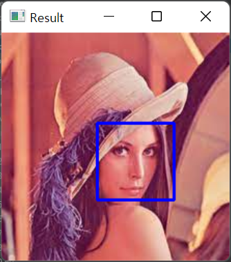

# OpenCV 공부 - Day5
### Reference
> https://www.youtube.com/watch?v=WQeoO7MI0Bs&t=2990s

<br>

## Chap9. Face detection

## 9.1 code : haarcascade_frontalface_default
```python
import cv2

faceCascade = cv2.CascadeClassifier("./Resources/haarcascade_frontalface_default.xml")
img = cv2.imread("./img/img1/lena.jpg")
imgGray = cv2.cvtColor(img, cv2.COLOR_BGR2GRAY)

faces = faceCascade.detectMultiScale(imgGray, 1.1, 4)
print("faces :", faces)

for (x, y, w, h) in faces :
    cv2.rectangle(img, (x, y), (x+w, y+h), (255, 0, 0), 2)

cv2.imshow("Result", img)
cv2.waitKey(0)
```
- [cv2.CascadeClassifier(), detectMultiScale()](https://deep-learning-study.tistory.com/244)
- 다소 오래된 알고리즘임에도 비교적 빨리 사람 얼굴을 인식할 수 있으며, 이외에도 다양한 영상인식 알고리즘이 존재함.
- [OpenCV github](https://github.com/opencv/opencv/tree/4.x/data/haarcascades)에서 원하는 알고리즘(xml 파일)을 다운받아 실행하면 됨.


```text
# 출력결과

faces = (x, y, w, h) : [[92 87 74 74]]
```



<br>

## Project1. Virtual paint

Chapter 1의 Webcam 코드를 먼저 가져온다.

```python
# Webcam 사용
import cv2

cap = cv2.VideoCapture(0)
cap.set(3, 640)     # id number 3 : width
cap.set(4, 480)     # id number 4 : height
cap.set(10, 100)    # id number 10 : brightness

while True :
    success, img = cap.read()
    cv2.imshow("Video", img)
    if cv2.waitKey(1) & 0xFF == ord('q') :
        break
```

