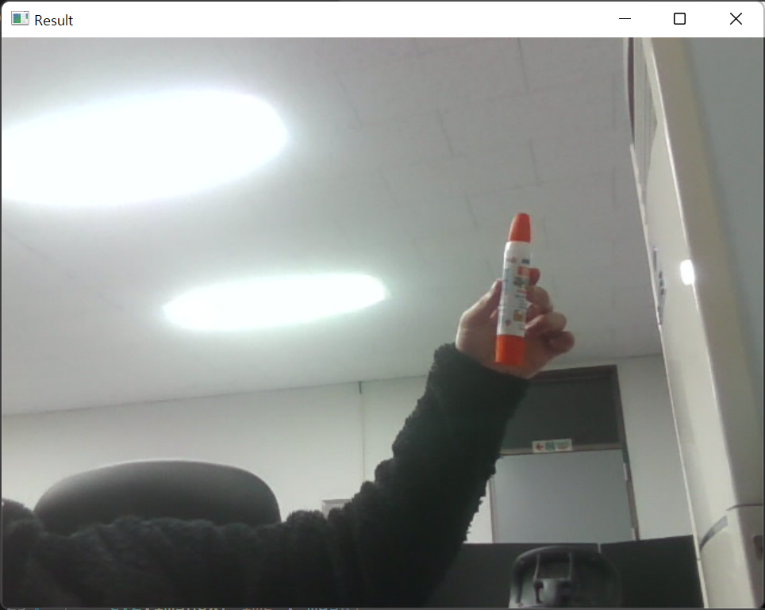
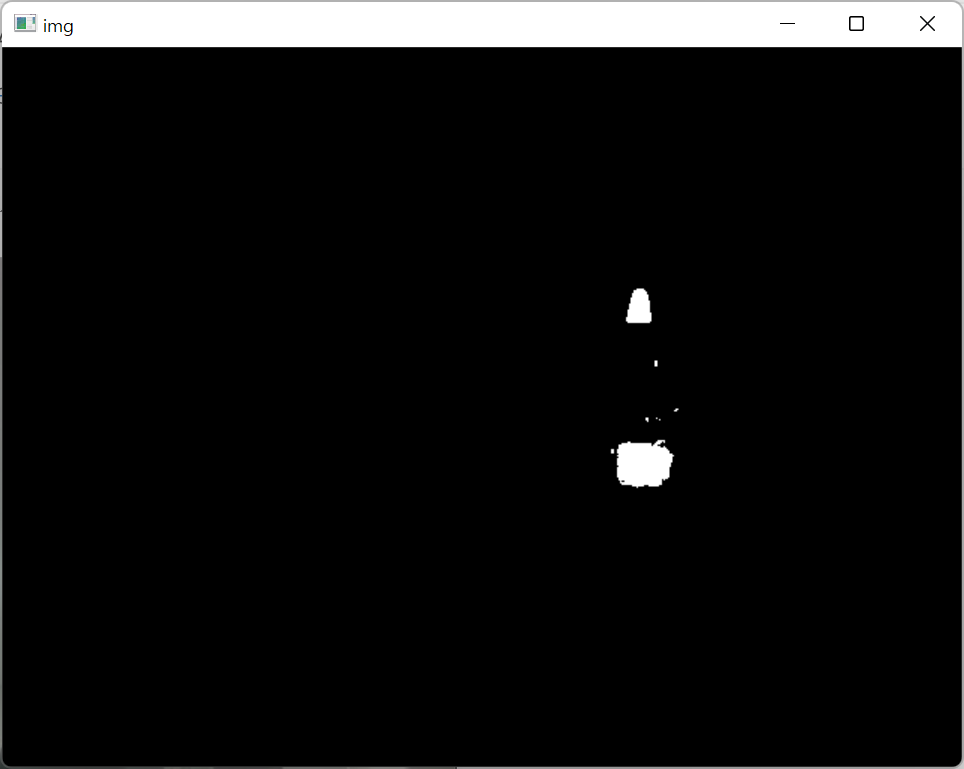
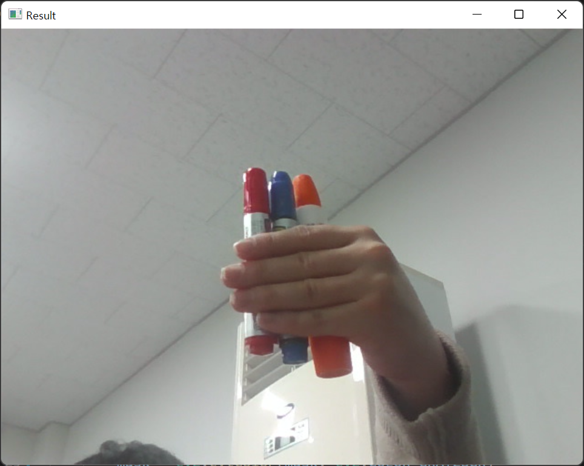
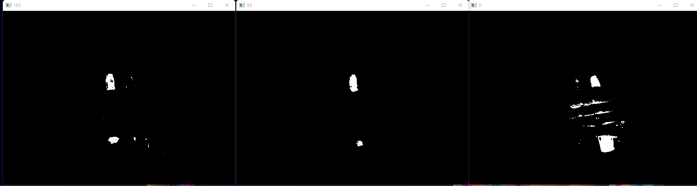
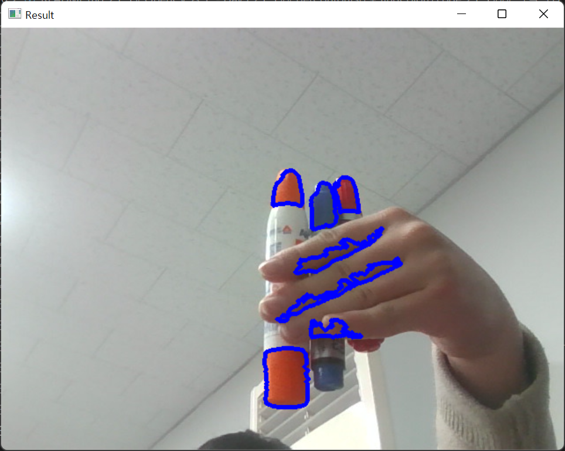
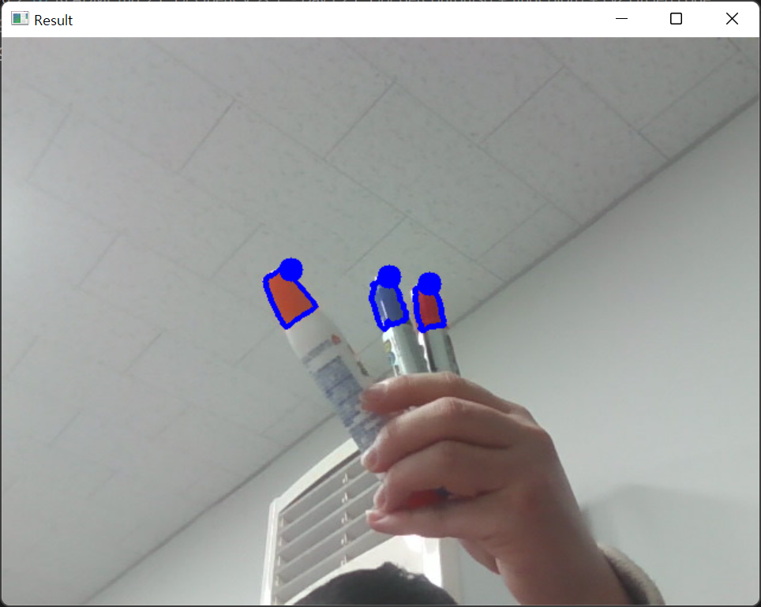
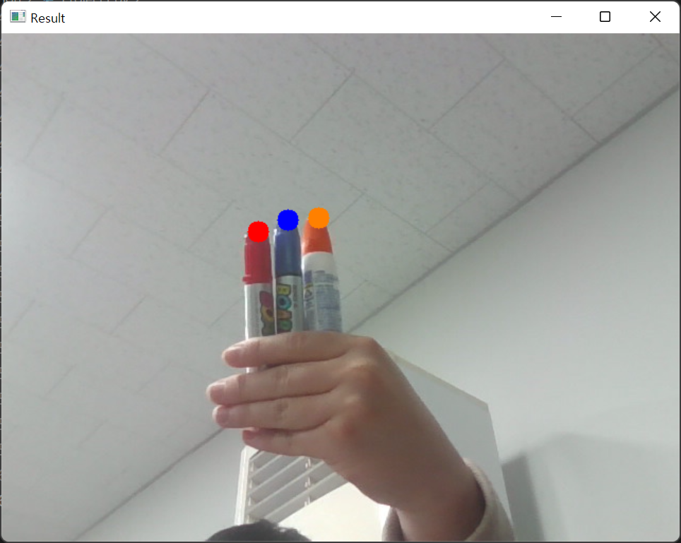
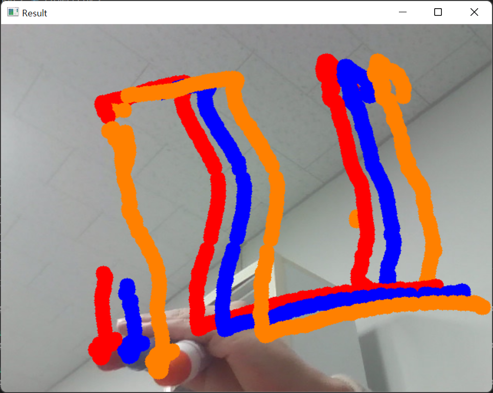

# OpenCV 공부 - Day5
### Reference
> https://www.youtube.com/watch?v=WQeoO7MI0Bs&t=2990s

<br>

## Project1. Virtual Paint

### colorPicker.py code

- 특정 색깔의 색상(Hue), 채도(Saturation), 명도(Value)를 트랙바(Trackbar)를 사용하여 구하는 코드

```python
import cv2
import numpy as np

frameWidth = 640
frameHeight = 480
cap = cv2.VideoCapture(0)
cap.set(3, frameWidth)
cap.set(4, frameHeight)

def empty(a) :
    pass

cv2.namedWindow("HSV")
cv2.resizeWindow("HSV", 640, 240)
cv2.createTrackbar("HUE MIN", "HSV", 0, 179, empty)
cv2.createTrackbar("HUE MAX", "HSV", 179, 179, empty)
cv2.createTrackbar("SAT MIN", "HSV", 0, 255, empty)
cv2.createTrackbar("SAT MAX", "HSV", 255, 255, empty)
cv2.createTrackbar("VALUE MIN", "HSV", 0, 255, empty)
cv2.createTrackbar("VALUE MAX", "HSV", 255, 255, empty)

while True :
    success, img = cap.read()
    imgHSV = cv2.cvtColor(img, cv2.COLOR_BGR2HSV)

    h_min = cv2.getTrackbarPos("HUE MIN", "HSV")
    h_max = cv2.getTrackbarPos("HUE MAX", "HSV")
    s_min = cv2.getTrackbarPos("SAT MIN", "HSV")
    s_max = cv2.getTrackbarPos("SAT MAX", "HSV")
    v_min = cv2.getTrackbarPos("VALUE MIN", "HSV")
    v_max = cv2.getTrackbarPos("VALUE MAX", "HSV")
    print(h_min)

    lower = np.array([h_min, s_min, v_min])
    upper = np.array([h_max, s_max, v_max])
    mask = cv2.inRange(imgHSV, lower, upper)
    result = cv2.bitwise_and(img, img, mask=mask)

    mask = cv2.cvtColor(mask, cv2.COLOR_GRAY2BGR)
    hStack = np.hstack([img, mask, result])
    cv2.imshow("Horizontal Stacking", hStack)
    
    if cv2.waitKey(1) & 0xFF == ord('q') :
        break

cap.release()
cv2.destroyAllWindows()
```
- 위의 코드를 실행하여 빨간색, 파란색, 노란색의 색상, 채도, 명도를 구함

[Hue Min, Hue Max, Saturation Min, Saturation Max, Value Min, Value Max]  
- `RED` : [163, 179, 110, 255, 0, 255]  
- `BLUE` : [93, 126, 61, 255, 0, 255]  
- `YELLOW` : [11, 28, 114, 255, 171, 255]

위의 값을 토대로, 노트북 Webcam을 사용하여 실시간으로 특정 색깔만 흑백 화면에 출력하는 코드를 아래에 작성하였다.

<br>

### findColor code
```python
import cv2
from cv2 import findContours
import numpy as np

frameWidth = 640
frameHeight = 480

cap = cv2.VideoCapture(0)
cap.set(3, frameWidth)      # id number 3 : width
cap.set(4, frameHeight)     # id number 4 : height
# cap.set(10, 150)    # id number 10 : brightness

myColors = [[163, 179, 110, 255, 0, 255],   # RED
            [93, 126, 61, 255, 0, 255],     # BLUE
            [11, 28, 114, 255, 171, 255]]   # YELLOW

def findColor(img, myColors) :
    imgHSV = cv2.cvtColor(img, cv2.COLOR_BGR2HSV)
    lower = np.array(myColors[0][0:3])      # RED의 lower boundary
    upper = np.array(myColors[0][3:6])      # RED의 upper boundary
    mask = cv2.inRange(imgHSV, lower, upper)
    cv2.imshow("img", mask)

while True :
    success, img = cap.read()
    findColor(img, myColors)
    cv2.imshow("Result", img)
    
    if cv2.waitKey(1) & 0xFF == ord('q') :
        break
```
- 실행해보았으나 빨간색에 대한 반응이 없었음
- 원인을 찾기 위해 동영상에서 작성한 오렌지 색상에 대한 코드를 실행시켜보았는데 정상 동작하였음(아래 결과 확인)


### 출력결과 : ORANGE




<br>

**원인**
- `colorPicker.py` 코드를 사용하여 직접 구한 빨간색의 색상, 채도, 명도 값을 `myColors` 리스트에 넣어줄 때 잘못 입력하였음

- lower boundary 값([Hue Min, Saturation Min, Value Min])을 먼저 입력하고 upper boundary 값([Hue Max, Saturation Max, Value Max])을 입력했어야 하지만, 필자의 경우 [Hue Min, Hue Max, Saturation Min, Saturation Max, Value Min, Value Max]의 순서로 리스트에 저장하여 빨간색에 대한 출력이 불가능하였음

- 수정된 코드는 아래 참고

### findColor code : RED
```python

...(생략)

myColors = [[163, 110, 0, 179, 255, 255],   # RED
            [93, 61, 0, 126, 255, 255],     # BLUE
            [11, 114, 171, 28, 255, 255]]   # YELLOW
            # [0, 107, 0, 19, 255, 255]]      # ORANGE

...(생략)

```

- RED  
[163, 179, 110, 255, 0, 255]    =>    [163, 110, 0, 179, 255, 255]
- 위와 마찬가지로 BLUE, YELLOW에 대해서도 변경해줌

### 출력결과 : RED


- 빨간색에 대해서 정상 동작한 것을 확인할 수 있음

<br>

### 여러 색상 출력(반복문 사용) : RED, BLUE, ORANGE

- 원래는 빨간색, 파란색, 노란색에 대해 실습하려 하였으나 노란색 보드마카가 없어 오렌지(목공풀) 색상으로 대체함

```python

...(생략)

myColors = [[163, 110, 0, 179, 255, 255],   # RED
            [93, 61, 0, 126, 255, 255],     # BLUE
            # [11, 114, 171, 28, 255, 255]]   # YELLOW
            [0, 107, 0, 19, 255, 255]]      # ORANGE


def findColor(img, myColors) :
    imgHSV = cv2.cvtColor(img, cv2.COLOR_BGR2HSV)
    for color in myColors :
        lower = np.array(color[:3])
        upper = np.array(color[3:])
        mask = cv2.inRange(imgHSV, lower, upper)
        cv2.imshow(str(color[0]), mask)

...(생략)

```

### 출력결과 : all



<br>


## getContours() + findColor() code
```python
import cv2
from cv2 import findContours
import numpy as np

frameWidth = 640
frameHeight = 480

cap = cv2.VideoCapture(0)
cap.set(3, frameWidth)     # id number 3 : width
cap.set(4, frameHeight)     # id number 4 : height

myColors = [[163, 110, 0, 179, 255, 255],   # RED
            [93, 61, 0, 126, 255, 255],     # BLUE
            # [11, 114, 171, 28, 255, 255]]   # YELLOW
            [0, 107, 0, 19, 255, 255]]      # ORANGE

def findColor(img, myColors) :
    imgHSV = cv2.cvtColor(img, cv2.COLOR_BGR2HSV)
    for color in myColors :
        lower = np.array(color[:3])
        upper = np.array(color[3:])
        mask = cv2.inRange(imgHSV, lower, upper)
        # mask를 getContours() 함수에 매개변수로 넣어줌
        getContours(mask)
        # cv2.imshow(str(color[0]), mask)

# Chap8의 getContours() 함수
def getContours(img) :
    contours, hierarchy = cv2.findContours(img, cv2.RETR_EXTERNAL, cv2.CHAIN_APPROX_NONE)
    for cnt in contours :
        area = cv2.contourArea(cnt)

        if area > 500 :
            cv2.drawContours(imgResult, cnt, -1, (255, 0, 0), 3)
            peri = cv2.arcLength(cnt, True)
            approx = cv2.approxPolyDP(cnt, 0.02*peri, True)
            x, y, w, h = cv2.boundingRect(approx)

while True :
    success, img = cap.read()
    # 원본 이미지를 imgResult
    imgResult = img.copy()
    findColor(img, myColors)
    cv2.imshow("Result", imgResult)
    
    if cv2.waitKey(1) & 0xFF == ord('q') :
        break
```
- Chap8의 `getContours()` 함수를 가져와서 `findColor()` 함수와 연계해서 사용함


### 출력결과


<br>

## getContours() + findColor() + cv2.circle() code
```python
import cv2
from cv2 import findContours
import numpy as np

frameWidth = 640
frameHeight = 480

cap = cv2.VideoCapture(0)
cap.set(3, frameWidth)     # id number 3 : width
cap.set(4, frameHeight)     # id number 4 : height

myColors = [[163, 110, 0, 179, 255, 255],   # RED
            [93, 61, 0, 126, 255, 255],     # BLUE
            # [11, 114, 171, 28, 255, 255]]   # YELLOW
            [0, 107, 0, 19, 255, 255]]      # ORANGE

def findColor(img, myColors) :
    imgHSV = cv2.cvtColor(img, cv2.COLOR_BGR2HSV)
    for color in myColors :
        lower = np.array(color[:3])
        upper = np.array(color[3:])
        mask = cv2.inRange(imgHSV, lower, upper)
        # mask를 getContours() 함수에 매개변수로 넣어줌
        x, y = getContours(mask)
        cv2.circle(imgResult, (x, y), 10, (255, 0, 0), cv2.FILLED)
        # cv2.imshow(str(color[0]), mask)

# Chap8의 getContours() 함수
def getContours(img) :
    contours, hierarchy = cv2.findContours(img, cv2.RETR_EXTERNAL, cv2.CHAIN_APPROX_NONE)

    # area > 500이 아닌 경우에도 값이 출력되어야 하므로 아래와 같이 지정해줌
    x, y, w, h = 0, 0, 0, 0

    for cnt in contours :
        area = cv2.contourArea(cnt)

        if area > 500 :
            cv2.drawContours(imgResult, cnt, -1, (255, 0, 0), 3)
            peri = cv2.arcLength(cnt, True)
            approx = cv2.approxPolyDP(cnt, 0.02*peri, True)
            x, y, w, h = cv2.boundingRect(approx)

    # findColor() 함수의 cv2.circle() 함수에 사용될 포인트 return
    return x+w//2, y

while True :
    success, img = cap.read()
    # 원본 이미지를 imgResult
    imgResult = img.copy()
    findColor(img, myColors)
    cv2.imshow("Result", imgResult)
    
    if cv2.waitKey(1) & 0xFF == ord('q') :
        break
```

### 출력결과


<br>

## myColorValues

Detect된 색상에 따라 원의 색깔이 변하게 바꾸는 코드

```python
import cv2
from cv2 import findContours
import numpy as np

frameWidth = 640
frameHeight = 480

cap = cv2.VideoCapture(0)
cap.set(3, frameWidth)     # id number 3 : width
cap.set(4, frameHeight)     # id number 4 : height

myColors = [[163, 110, 0, 179, 255, 255],   # RED
            [93, 61, 0, 126, 255, 255],     # BLUE
            # [11, 114, 171, 28, 255, 255]]   # YELLOW
            [0, 107, 0, 19, 255, 255]]      # ORANGE

# BGR 형태로 저장
myColorValues = [[0, 0, 255],       # RED
                 [255, 0, 0],       # BLUE
                 [0, 128, 255]]     # ORANGE

def findColor(img, myColors, myColorValues) :
    imgHSV = cv2.cvtColor(img, cv2.COLOR_BGR2HSV)
    count = 0
    for color in myColors :
        lower = np.array(color[:3])
        upper = np.array(color[3:])
        mask = cv2.inRange(imgHSV, lower, upper)
        # mask를 getContours() 함수에 매개변수로 넣어줌
        x, y = getContours(mask)
        # myColorValues의 인덱스(count)가 증가함에 따라, 원의 색깔이 해당 색상으로 변하게 됨
        cv2.circle(imgResult, (x, y), 10, myColorValues[count], cv2.FILLED)
        count += 1

# Chap8의 getContours() 함수
def getContours(img) :
    contours, hierarchy = cv2.findContours(img, cv2.RETR_EXTERNAL, cv2.CHAIN_APPROX_NONE)

    # area > 500이 아닌 경우에도 값이 출력되어야 하므로 아래와 같이 지정해줌
    x, y, w, h = 0, 0, 0, 0

    for cnt in contours :
        area = cv2.contourArea(cnt)

        if area > 500 :
            # cv2.drawContours(imgResult, cnt, -1, (255, 0, 0), 3)
            peri = cv2.arcLength(cnt, True)
            approx = cv2.approxPolyDP(cnt, 0.02*peri, True)
            x, y, w, h = cv2.boundingRect(approx)

    # findColor() 함수의 cv2.circle() 함수에 사용될 포인트 return
    return x+w//2, y

while True :
    success, img = cap.read()
    # 원본 이미지를 imgResult
    imgResult = img.copy()
    findColor(img, myColors, myColorValues)
    cv2.imshow("Result", imgResult)
    
    if cv2.waitKey(1) & 0xFF == ord('q') :
        break
```
- `myColorValues` 리스트를 정의하여 해당 색상 값(BGR)을 RED, BLUE, ORANGE 순서로 저장했음
- findColor() 함수의 매개변수로 `myColorValues`를 추가해줌
- ORAGE의 `RGB 값`을 알기위해서 [RGB color code를 검색](https://www.rapidtables.com/web/color/RGB_Color.html)하여 값을 얻음

### 출력결과


<br>

## Project1 전체 코드
```python
import cv2
from cv2 import findContours
import numpy as np

frameWidth = 640
frameHeight = 480

cap = cv2.VideoCapture(0)
cap.set(3, frameWidth)     # id number 3 : width
cap.set(4, frameHeight)     # id number 4 : height

myColors = [[163, 110, 0, 179, 255, 255],   # RED
            [93, 61, 0, 126, 255, 255],     # BLUE
            # [11, 114, 171, 28, 255, 255]]   # YELLOW
            [0, 107, 0, 19, 255, 255]]      # ORANGE

# BGR 형태로 저장
myColorValues = [[0, 0, 255],       # RED
                 [255, 0, 0],       # BLUE
                 [0, 128, 255]]     # ORANGE

def findColor(img, myColors, myColorValues) :
    imgHSV = cv2.cvtColor(img, cv2.COLOR_BGR2HSV)
    count = 0
    newPoints = []
    for color in myColors :
        lower = np.array(color[:3])
        upper = np.array(color[3:])
        mask = cv2.inRange(imgHSV, lower, upper)
        # mask를 getContours() 함수에 매개변수로 넣어줌
        x, y = getContours(mask)
        # myColorValues의 인덱스(count)가 증가함에 따라, 원의 색깔이 해당 색상으로 변하게 됨
        cv2.circle(imgResult, (x, y), 10, myColorValues[count], cv2.FILLED)
        if x != 0 and y != 0 :
            newPoints.append([x, y, count])
        count += 1

    return newPoints

# Chap8의 getContours() 함수
def getContours(img) :
    contours, hierarchy = cv2.findContours(img, cv2.RETR_EXTERNAL, cv2.CHAIN_APPROX_NONE)

    # area > 500이 아닌 경우에도 값이 출력되어야 하므로 아래와 같이 지정해줌
    x, y, w, h = 0, 0, 0, 0

    for cnt in contours :
        area = cv2.contourArea(cnt)

        if area > 500 :
            # cv2.drawContours(imgResult, cnt, -1, (255, 0, 0), 3)
            peri = cv2.arcLength(cnt, True)
            approx = cv2.approxPolyDP(cnt, 0.02*peri, True)
            x, y, w, h = cv2.boundingRect(approx)

    # findColor() 함수의 cv2.circle() 함수에 사용될 포인트 return
    return x+w//2, y

def drawOnCanvas(myPoints, myColorValues) :
    for point in myPoints :
        cv2.circle(imgResult, (point[0], point[1]), 10, myColorValues[point[2]], cv2.FILLED)
        

myPoints = []   # [x, y, colorId]

while True :
    success, img = cap.read()
    # 원본 이미지를 imgResult
    imgResult = img.copy()
    newPoints = findColor(img, myColors, myColorValues)
    if len(newPoints) != 0 :
        for newP in newPoints :
            myPoints.append(newP)
    if len(myPoints) != 0 :
        drawOnCanvas(myPoints, myColorValues)


    cv2.imshow("Result", imgResult)
    
    if cv2.waitKey(1) & 0xFF == ord('q') :
        break
```

### 출력결과
