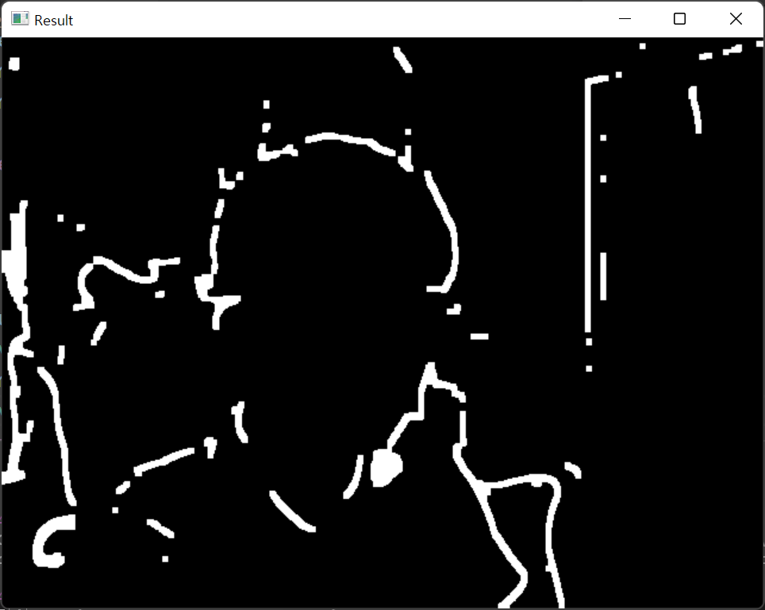
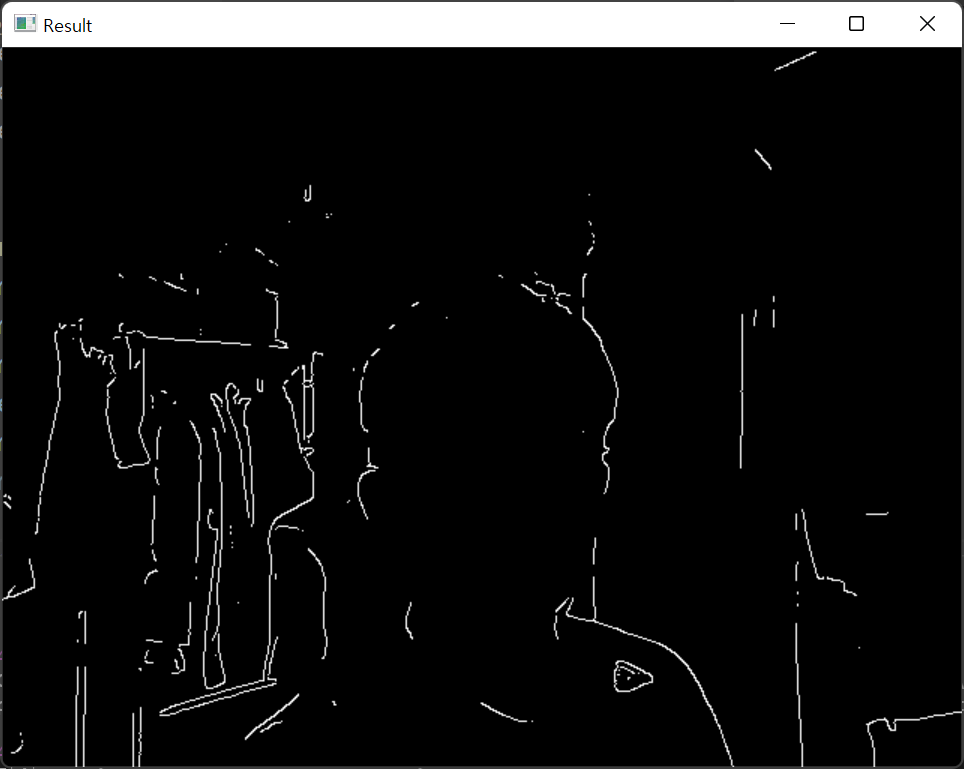
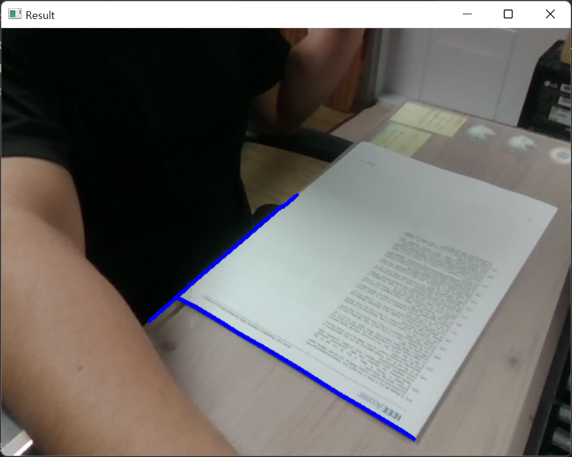
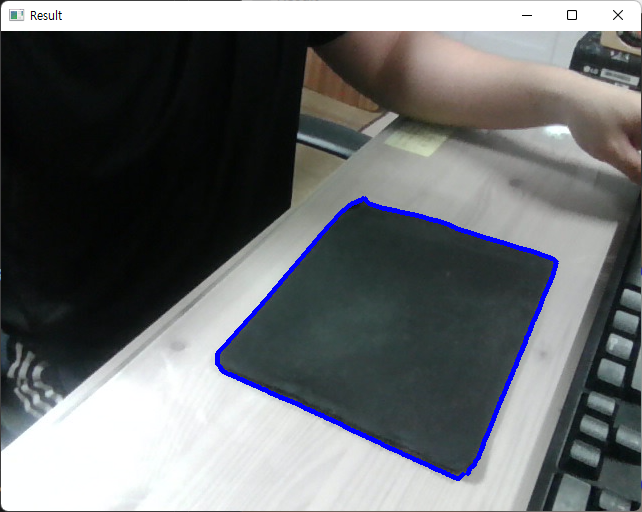
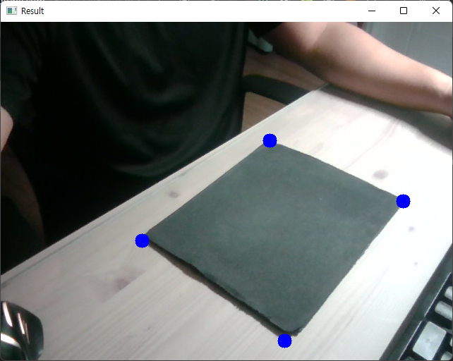
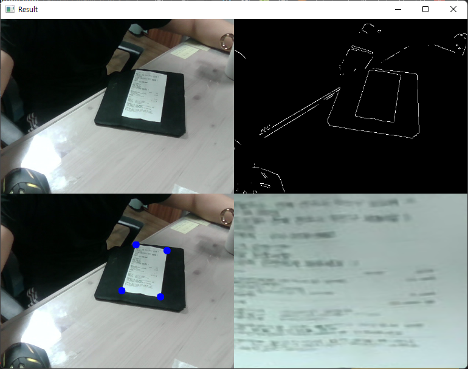

# OpenCV 공부 - Day7
### Reference
> https://www.youtube.com/watch?v=WQeoO7MI0Bs&t=2990s

<br>

## Project2. Document Scanner

### Preprocessing
```python
# Webcam 사용
import cv2
import numpy as np


####################################
widthImg = 640
heightImg = 480
####################################

cap = cv2.VideoCapture(0)
cap.set(3, widthImg)     # id number 3 : width
cap.set(4, heightImg)     # id number 4 : height
cap.set(10, 100)    # id number 10 : brightness


def preprocessing(img) :
    imgGray = cv2.cvtColor(img, cv2.COLOR_BGR2GRAY)
    imgBlur = cv2.GaussianBlur(imgGray, (5, 5), 1)
    imgCanny = cv2.Canny(imgBlur, 200, 200)
    kernel = np.ones((5, 5))
    imgDial = cv2.dilate(imgCanny, kernel, iterations=2)
    imgThres = cv2.erode(imgDial, kernel, iterations=1)

    # 필요에 따라 imgThres와 imgCanny를 번갈아가며 출력가능
    return imgThres
    # return imgCanny


while True :
    success, img = cap.read()
    cv2.resize(img, (widthImg, heightImg))
    imgThres = preprocessing(img)
    cv2.imshow("Result", imgThres)
    if cv2.waitKey(1) & 0xFF == ord('q') :
        break
```
- [`cv2.erode & cv2.dilate`](https://nicewoong.github.io/development/2018/01/05/erosion-and-dilation/)에 대한 설명


### Result(preprocessing) : `return imgThres`


<br>

### Result(preprocessing) : `return imgCanny`


<br>


### getContours()
```python
# Webcam 사용
import cv2
import numpy as np


####################################
widthImg = 640
heightImg = 480
####################################

cap = cv2.VideoCapture(0)
cap.set(3, widthImg)     # id number 3 : width
cap.set(4, heightImg)     # id number 4 : height
# cap.set(10, 100)    # id number 10 : brightness


def preprocessing(img) :
    imgGray = cv2.cvtColor(img, cv2.COLOR_BGR2GRAY)
    imgBlur = cv2.GaussianBlur(imgGray, (5, 5), 1)
    imgCanny = cv2.Canny(imgBlur, 200, 200)
    kernel = np.ones((5, 5))
    imgDial = cv2.dilate(imgCanny, kernel, iterations=2)
    imgThres = cv2.erode(imgDial, kernel, iterations=1)

    # return imgThres
    return imgCanny


# Chap8의 getContours() 함수를 가져옴
def getContours(img) :
    biggest = np.array([])
    maxArea = 0
    contours, hierarchy = cv2.findContours(img, cv2.RETR_EXTERNAL, cv2.CHAIN_APPROX_NONE)
    print("len(contours) :", len(contours))
    for cnt in contours :
        area = cv2.contourArea(cnt)
        print("area :", area)
        # area는 상황에 따라 유동적으로 변경할 수 있음
        # 되도록 검정바탕에 흰색 종이를 위치할수록 area 값이 커짐
        if area > 100 :
            cv2.drawContours(imgContour, cnt, -1, (255, 0, 0), 3)
            peri = cv2.arcLength(cnt, True)
            approx = cv2.approxPolyDP(cnt, 0.02*peri, True)
            if area > maxArea and len(approx) == 4 :
                biggest = approx
                maxArea = area

    return biggest


while True :
    success, img = cap.read()
    cv2.resize(img, (widthImg, heightImg))
    imgContour = img.copy()
    imgThres = preprocessing(img)
    getContours(imgThres)
    cv2.imshow("Result", imgContour)
    if cv2.waitKey(1) & 0xFF == ord('q') :
        break
```
- Chap8의 getContours() 함수를 가져와서 약간의 수정을 해줌
- 영상에서는 `area > 5000`을 조건식으로 주었으나, 나의 경우 `area > 100`으로 하여도 인식이 잘되지 않음
- 아마 검정바탕에 흰색 종이와 같이, 대비되는 색이 area를 잘 인식하는 것으로 생각됨
- 따라서 밝은 바탕에 검정색 마우스패드를 위치시킨 후 `area > `로 주었더니 인식이 잘 되었음

### Result(getContours)


- 밝은 바탕에 흰색 종이를 인식한 경우(`area > 100`)
- 인식이 잘 안되는 것을 확인할 수 있음. 오히려 검정색 옷과 흰색 종이가 더 잘 구분되는 것을 확인할 수 있음.




- 밝은 바탕에 검정색 마우스패드를 인식한 경우(`area > 200`)
- 이전보다 인식이 더 잘 되는 것을 확인할 수 있음. 심지어 `area > 200`를 올렸음에도 인식이 잘됨. 이를 통해, 서로 대비되는 색깔일수록 Contour가 더 잘되는 것으로 생각해볼 수 있음.

<br>


### Four Point detect
```python
# Webcam 사용
import cv2
import numpy as np


####################################
widthImg = 640
heightImg = 480
####################################

cap = cv2.VideoCapture(0)
cap.set(3, widthImg)     # id number 3 : width
cap.set(4, heightImg)     # id number 4 : height
# cap.set(10, 100)    # id number 10 : brightness


def preprocessing(img) :
    imgGray = cv2.cvtColor(img, cv2.COLOR_BGR2GRAY)
    imgBlur = cv2.GaussianBlur(imgGray, (5, 5), 1)
    imgCanny = cv2.Canny(imgBlur, 200, 200)
    kernel = np.ones((5, 5))
    imgDial = cv2.dilate(imgCanny, kernel, iterations=2)
    imgThres = cv2.erode(imgDial, kernel, iterations=1)

    # return imgThres
    return imgCanny


# Chap8의 getContours() 함수를 가져옴
def getContours(img) :
    biggest = np.array([])
    maxArea = 0
    contours, hierarchy = cv2.findContours(img, cv2.RETR_EXTERNAL, cv2.CHAIN_APPROX_NONE)
    for cnt in contours :
        area = cv2.contourArea(cnt)

        if area > 200 :
            # cv2.drawContours(imgContour, cnt, -1, (255, 0, 0), 3)
            peri = cv2.arcLength(cnt, True)
            approx = cv2.approxPolyDP(cnt, 0.02*peri, True)
            if area > maxArea and len(approx) == 4 :
                biggest = approx
                maxArea = area
    cv2.drawContours(imgContour, biggest, -1, (255, 0, 0), 20)

    return biggest

def getWarp(img, biggest) :
    pass


while True :
    success, img = cap.read()
    cv2.resize(img, (widthImg, heightImg))
    imgContour = img.copy()

    imgThres = preprocessing(img)
    biggest = getContours(imgThres)
    print(biggest)
    getWarp(img, biggest)

    cv2.imshow("Result", imgContour)
    if cv2.waitKey(1) & 0xFF == ord('q') :
        break
```
- `cv2.drawContours(imgContour, biggest, -1, (255, 0, 0), 20)` 함수의 매개변수와 위치를 변경해주었음


### Result


<br>

### Full code
```python
# Webcam 사용
import cv2
from matplotlib.pyplot import axis
import numpy as np


####################################
widthImg = 360
heightImg = 640
####################################

cap = cv2.VideoCapture(0)
cap.set(3, 640)     # id number 3 : width
cap.set(4, 480)     # id number 4 : height
# cap.set(10, 100)    # id number 10 : brightness


def preprocessing(img) :
    imgGray = cv2.cvtColor(img, cv2.COLOR_BGR2GRAY)
    imgBlur = cv2.GaussianBlur(imgGray, (5, 5), 1)
    imgCanny = cv2.Canny(imgBlur, 200, 200)
    kernel = np.ones((5, 5))
    imgDial = cv2.dilate(imgCanny, kernel, iterations=2)
    imgThres = cv2.erode(imgDial, kernel, iterations=1)

    # return imgThres
    return imgCanny


# Chap8의 getContours() 함수를 가져옴
def getContours(img) :
    biggest = np.array([])
    maxArea = 0
    contours, hierarchy = cv2.findContours(img, cv2.RETR_EXTERNAL, cv2.CHAIN_APPROX_NONE)
    for cnt in contours :
        area = cv2.contourArea(cnt)

        if area > 250 :
            # cv2.drawContours(imgContour, cnt, -1, (255, 0, 0), 3)
            peri = cv2.arcLength(cnt, True)
            approx = cv2.approxPolyDP(cnt, 0.02*peri, True)
            if area > maxArea and len(approx) == 4 :
                biggest = approx
                maxArea = area
    cv2.drawContours(imgContour, biggest, -1, (255, 0, 0), 20)

    return biggest

def reorder(myPoints) :
    myPoints = myPoints.reshape((4, 2))
    # biggest.shape : (4, 1, 2)
    myPointsNew = np.zeros((4, 1, 2), np.int32)
    add = myPoints.sum(1)   # axis 1을 기준으로 더함
    # print("add :", add)

    myPointsNew[0] = myPoints[np.argmin(add)]
    myPointsNew[3] = myPoints[np.argmax(add)]
    diff = np.diff(myPoints, axis=1)
    myPointsNew[1] = myPoints[np.argmin(diff)]
    myPointsNew[2] = myPoints[np.argmax(diff)]
    # print("NewPoints :", myPointsNew)

    return myPointsNew


def getWarp(img, biggest) :
    biggest = reorder(biggest)
    # Chap5에서 pts1, pts2, matrix, imgOutput 코드를 가져옴
    pts1 = np.float32(biggest)
    pts2 = np.float32([[0, 0], [widthImg, 0], [0, heightImg], [widthImg, heightImg]])
    matrix = cv2.getPerspectiveTransform(pts1, pts2)
    imgOutput = cv2.warpPerspective(img, matrix, (widthImg, heightImg))

    imgCropped = imgOutput[20:imgOutput.shape[0]-2, 20:imgOutput.shape[1]-20]
    imgCropped = cv2.resize(imgCropped, (widthImg, heightImg))

    return imgCropped


def stackImages(scale,imgArray):
    rows = len(imgArray)
    cols = len(imgArray[0])
    rowsAvailable = isinstance(imgArray[0], list)
    width = imgArray[0][0].shape[1]
    height = imgArray[0][0].shape[0]
    if rowsAvailable:
        for x in range ( 0, rows):
            for y in range(0, cols):
                if imgArray[x][y].shape[:2] == imgArray[0][0].shape [:2]:
                    imgArray[x][y] = cv2.resize(imgArray[x][y], (0, 0), None, scale, scale)
                else:
                    imgArray[x][y] = cv2.resize(imgArray[x][y], (imgArray[0][0].shape[1], imgArray[0][0].shape[0]), None, scale, scale)
                if len(imgArray[x][y].shape) == 2: imgArray[x][y]= cv2.cvtColor( imgArray[x][y], cv2.COLOR_GRAY2BGR)
        imageBlank = np.zeros((height, width, 3), np.uint8)
        hor = [imageBlank]*rows
        hor_con = [imageBlank]*rows
        for x in range(0, rows):
            hor[x] = np.hstack(imgArray[x])
        ver = np.vstack(hor)
    else:
        for x in range(0, rows):
            if imgArray[x].shape[:2] == imgArray[0].shape[:2]:
                imgArray[x] = cv2.resize(imgArray[x], (0, 0), None, scale, scale)
            else:
                imgArray[x] = cv2.resize(imgArray[x], (imgArray[0].shape[1], imgArray[0].shape[0]), None,scale, scale)
            if len(imgArray[x].shape) == 2: imgArray[x] = cv2.cvtColor(imgArray[x], cv2.COLOR_GRAY2BGR)
        hor= np.hstack(imgArray)
        ver = hor
    return ver


while True :
    success, img = cap.read()
    cv2.resize(img, (widthImg, heightImg))
    imgContour = img.copy()

    imgThres = preprocessing(img)
    biggest = getContours(imgThres)
    
    # 화면에 변화가 생기면 에러가 발생하므로 이를 해결하기 위해 if-else 문을 추가함
    if biggest.size != 0 :
        imgWarped = getWarp(img, biggest)
        imageArray = ([img, imgThres],
                [imgContour, imgWarped])
    else :
        imageArray = ([img, imgThres],
                [img, img])
    
    stackedImages = stackImages(0.6, imageArray)

    cv2.imshow("Result", stackedImages)
    if cv2.waitKey(1) & 0xFF == ord('q') :
        break
```

### Result


- 화면을 꽉 채울만한 검정색 바탕과 조금 덜 밝은 조명 아래에서 인식을 했으면, 더 깔끔하게 Warping이 될 것으로 생각한다.
- 화질이 좋지 못한것은 실시간으로 캠으로 입력을 받기 때문에 어쩔 수 없다. 다만, 고해상도 이미지를 가지고 Warping을 할 경우 더 깔끔하게 나온다.